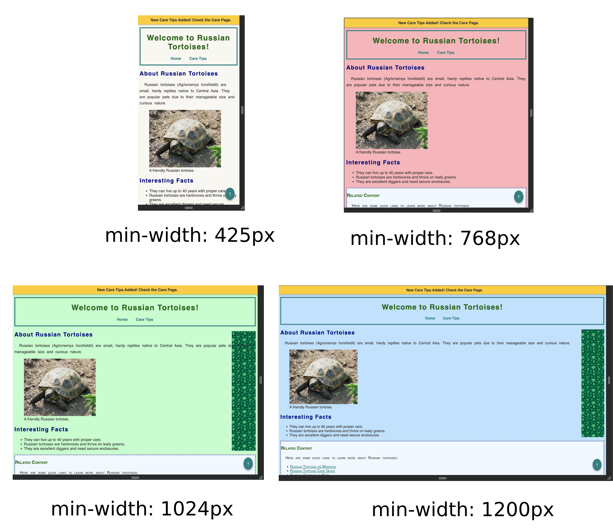

### U05-CW10 - Media Queries and Mobile-First Approach

## Objective
Students will learn how to use **CSS media queries** to make the Russian Tortoise website responsive by applying different background colors at specific breakpoints and adjusting the background image visibility.

## Breakpoints & Styling Changes
| Device Type      | Max Width (px) | Change |
|-----------------|--------------|--------|
| **Tablet**      | 768px        | Change background color to `#ffdfba` |
| **Small Desktop** | 1024px      | Change background color to `#baffc9`; reintroduce `tortoise-pattern.jpg` background image |
| **Large Desktop** | 1200px      | Change background color to `#bae1ff` |

---

## Steps to Add Media Queries

### 1️. Open `styles.css`
Locate your CSS file (`styles.css`) in the project directory.

### 2️. Understanding the Mobile-First Approach
The existing `body` ruleset in `styles.css` is already designed for **mobile devices** (default styles apply to smaller screens first). Media queries will be added to progressively adjust styles for **larger screens**.

### 3️. Add the Media Queries
At the **bottom of `styles.css`**, add new media queries for **Tablet, Small Desktop, and Large Desktop** breakpoints:

#### 📌 Tablet (min-width: 768px)
- Add a comment: `/* Tablet - min-width: 768px */`.
- Create a **new media query** for screens with a **minimum width of 768px**.
- Inside the media query, select the `body` tag.
- Set the **background color** to `#ffdfba`.

#### 📌 Small Desktop (min-width: 1024px)
- Add a comment: `/* Small Desktop - min-width: 1024px */`.
- Create a **new media query** for screens with a **minimum width of 1024px**.
- Inside the media query, select the `body` tag.
- Set the **background color** to `#baffc9`.
- **Find the original `main` ruleset** in `styles.css` (which includes `background-image: url("./images/tortoise-pattern.jpg")`).
- **Move the entire `main` ruleset inside this media query** so that the tortoise-pattern background **only appears on small desktops and larger**.

#### 📌 Large Desktop (min-width: 1200px)
- Add a comment: `/* Large Desktop - min-width: 1200px */`.
- Create a **new media query** for screens with a **minimum width of 1200px**.
- Inside the media query, select the `body` tag.
- Set the **background color** to `#bae1ff`.

### 4️. Save Your Changes
After adding the media queries, save `styles.css`.

### 5️. Test Responsiveness
- Open `index.html` in your web browser.
- Resize the window to **different widths** and observe the background changes.
- Use **Developer Tools** to simulate different screen sizes.

### 6️. Debug if Needed
If the background doesn't change at the correct breakpoints:
- Ensure the media queries are correctly added **at the bottom** of `styles.css`.
- Clear browser cache (Ctrl + Shift + R) and reload the page.
- Verify the CSS file is linked properly in `index.html`.

### 7. **Submit Your Work**

- Once you've confirmed that the button works and looks good, submit the following files inside Google Classroom:
  - `styles.css`

### 8. **Screenshot of Completed Assignment**

